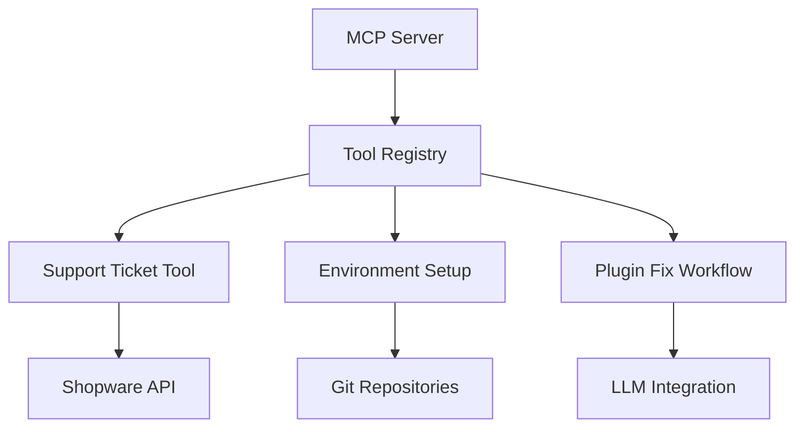
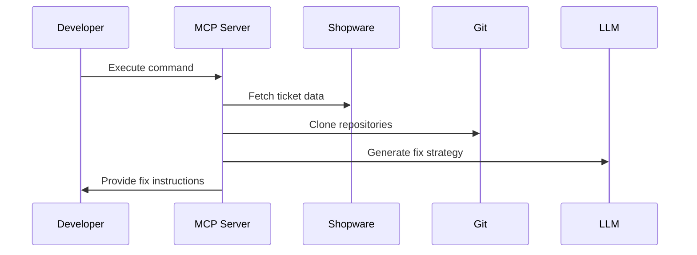

# Shopware MCP - Project Summary

## Overview
A local Model Context Protocol (MCP) server designed to automate bug fixing for Shopware plugins using LLMs. The server connects to Shopware support systems, manages development environments, and provides AI-assisted debugging workflows.

## Purpose
- Automate plugin bug resolution by integrating support tickets, version data, and LLM capabilities
- Streamline environment setup for reproducing plugin issues
- Provide structured guidance for plugin maintenance tasks

## Key Features
1. **Support Ticket Integration**: Fetches and processes Shopware support tickets (ABCDE-123456 format)
2. **Environment Management**: Clones and configures Shopware/plugin versions
3. **AI-Assisted Debugging**: Provides step-by-step bug fixing workflows
4. **Security**: Isolates sensitive customer data from LLM processing

## Architecture

## Implementation Details
- **Language**: TypeScript (ES Modules)
- **Runtime**: Node.js v22.15+
- **Core Dependencies**: 
  - `@modelcontextprotocol/sdk` - MCP framework
  - `zod` - Schema validation
- **Testing**: Vitest framework with comprehensive test coverage
- **Build System**: TypeScript compiler with Prettier formatting

## Coding Standards
- Strict TypeScript typing
- Prettier formatting with organized imports
- Modular architecture with single-responsibility tools
- Comprehensive Vitest unit tests
- Error handling with process exit codes

## Development Workflow

## Future Directions
- Browser interaction for automated testing
- Plugin code analysis tools
- CI/CD integration
- Expanded Shopware API coverage